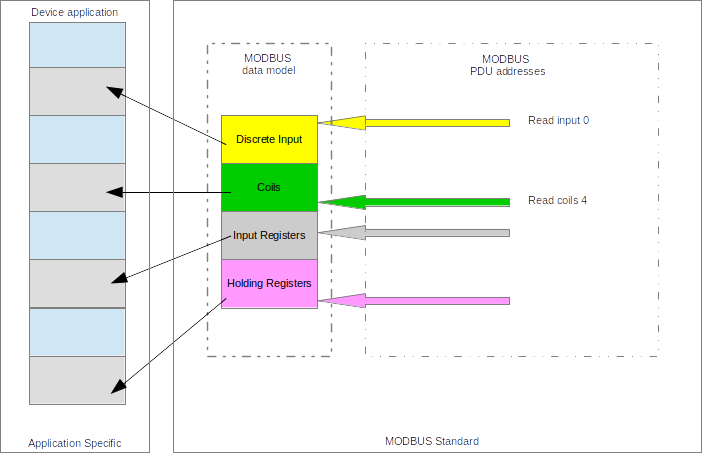
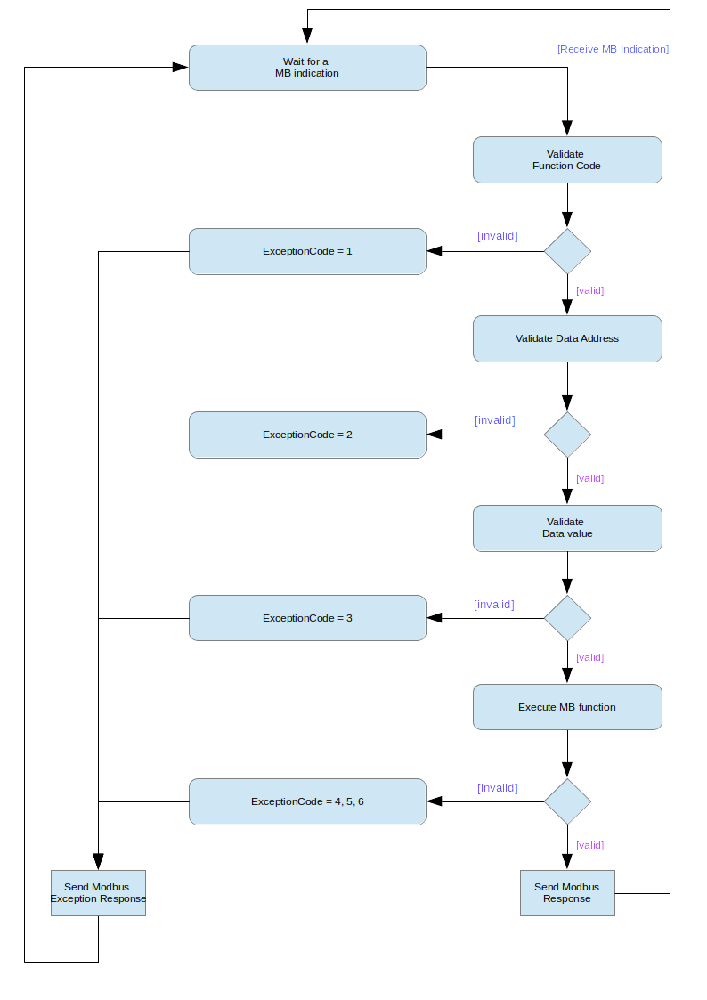

# MODBUS Application Protocol SPecification V1.1b3

## Introduction

MODBUS is an application layer messaging protocol for client/server communication between
devices connected on different types of buses or networks.

It is currently implemented using:

* TCP/IP over Ethernet. See MODBUS Messaging Implementation Guide V1.0a.
* Asynchronous serial transmission over a variety of media (wire : EIA/TIA -232-E, EIA-422,
EIA/TIA-485-A; fiber, radio, etc.)
* MODBUS PLUS, a high speed token passing network.

## Abbreviations

|Abbreviation |Description |
|---|--------------------|
| ADU | Application Data Unit
| HDLC | High Level Data Link Control |
| HMI | Human Machine Interface |
| IETF | Internet Engineering Task Force |
| I/O | Input / Output |
| IP | Internet Protocol |
| MAC | Media Access Control |
| MB | MODBUS Protocol |
| MBAP | MODBUS Application Protocol |
| PDU | Protocol Data Unit |
| PLC | Programmable Logic Controller |
| TCP | Transmission Control Protocol |

## Context
The MODBUS protocol allows an easy communication within all types of network architectures. Every type of devices (PLC, HMI, Control Panel, Driver, Motion control, I/O Device...) can use MODBUS protocol to initiate a remote operation.
The same communication can be done as well on serial line as on Ethernet TCP/IP networks. Gateways allow a communication between several types of buses or network using the MODBUS protocol.

## General Description

### Protocol description
The MODBUS protocol defines a simple protocol data unit (PDU) independent of the underlying communication layers. The mapping of MODBUS protocol on specific buses or network ccan introduce some additional fields on the Application Data Unit (ADU).

```
                                        ADU
<-------------------------------------------------------------------------------->
+--------------------+  +---------------+ +---------------------+  +-------------+
| Additional address |  | Function code | |         Data        |  | Error check |
+--------------------+  +---------------+ +---------------------+  +-------------+
                        <--------------------------------------->
                                        PDU
General MODBUS frame
```

The MODBUS application data unit is built by the client that initiates a MODBUS transaction. The function indicates to the server what kind of action to perform. The MODBUS application protocol establishes the format of a request initiated by a client.
The function code field of a MODBUS data unit is coded in one byte. Valid codes are in the range of 1..255 decimal ( where the range 128 - 255 is reserved and used for exception responses.) When a message is sent from a Client to a Server device the function code field tells the server what kind of action to perform. Function code "0" is not valid.

Sub function codes are added to some function codes to define multiple actions.
The data field of messages sent from a client to server devices contains additional information that the server uses to take the action defined by the function code. This can include items like discrete and register addresses, the quantity of items to be handled, ad the count of actual data bytes in the field. The data field may be non-existent (of zero-length) in certain kinds of requests, in this case the server does not require any additional information. The function code alone specifies the action.

If no error occurs related to the MODBUS function requested in a properly received MODBUS
ADU the data field of a response from a server to a client contains the data requested. If an
error related to the MODBUS function requested occurs, the field contains an exception code
that the server application can use to determine the next action to be taken.
For example a client can read the ON / OFF states of a group of discrete outputs or inputs or
it can read/write the data contents of a group of registers.
When the server responds to the client, it uses the function code field to indicate either a
normal (error-free) response or that some kind of error occurred (called an exception
response). For a normal response, the server simply echoes to the request the original
function code.

For an exception response, the server returns a code that is equivalent to the original function
code from the request PDU with its most significant bit set to logic 1.

The size of the MODBUS PDU is limited by the size constraint inherited from the first
MODBUS implementation on Serial Line network (max. RS485 ADU = 256 bytes).

Therefore: <br>
MODBUS PDU for serial line communication = 256 - Server address (1 byte) - CRC (2
bytes) = 253 bytes.

Consequently:<br>
RS232 / RS485 ADU = 253 bytes + Server address (1 byte) + CRC (2 bytes) = 256 bytes.
TCP MODBUS ADU = 253 bytes + MBAP (7 bytes) = 260 bytes.
The MODBUS protocol defines three PDUs. They are :<br>

| Full name | PDU | Definition | Description |
|-----------|-----|------------|-------------|
| MODBUS Request PDU | mb_req_pdu | {function_code, request_data} | function_code = [1 byte] MODBUS function code<br> request_data = [n bytes] This field is function code dependent and usually contains information such as variable references, variable counts, data offsets, sub-function codes etc |
| MODBUS Response PDU | mb_rsp_pdu | {function_code, response_data}| function_code = [1 byte] MODBUS function code <br> response_data = [n bytes] This field is function code dependent and usually contains information such as variable references, variable counts, data offsets, sub-function codes, etc. |
| MODBUS Exception Response PDU | mb_excep_rsp_pdu | {exception-function_code, request_data} | exception-function_code = [1 byte] MODBUS function code + 0x80 <br> exception_code = [1 byte] MODBUS Exception Code Defined in table "MODBUS Exception Codes" (see section 7 ). |


### Data Encoding

MODBUS uses a ‘big-Endian’ representation for addresses and data items. This means that when a numerical quantity larger than a single byte is transmitted, the most significant
byte is sent first. So for example : 

| Register size |  value |
|---------------|--------|
| 16 - bits     | 0x1234 |

the first byte sent is 0x12 then 0x34. By bitshifting and adding, the original value can be compiled. ( 0x12 << 8u = 0x1200 + 0x34 = 0x1234 )

## MODBUS Data Model
MODBUS bases its data model on a series of tables that have distinguishing characteristics. The four primary tables are:

| Primary tables | Object type | Type of | Comments |
|----------------|-------------|---------|----------|
| Discretes Input | Single Bit | Read-Only | This type of data can be provided by an I/O system. |
| Coils | Single Bit | Read-Write | This type of data can be alterable by an application program. |
| Input Registers | 16-bit word | Read-Only | This type of data can be provided by an I/O system |
| Holding Registers | 16-bit word | Read-Write | This type of data can be alterable by an application program. |

The distinctions between inputs and outputs, and between bit -addressable and word-
addressable data items, do not imply any application behavior. It is perfectly acceptable, and
very common, to regard all four tables as overlaying one another, if this is the most natural
interpretation on the target machine in question.
For each of the primary tables, the protocol allows individual selection of 65536 data items,
and the operations of read or write of those items are designed to span multiple consecutive
data items up to a data size limit which is dependent on the transaction function code.
It’s obvious that all the data handled via MODBUS (bits, registers) must be located in device
application memory. But physical address in memory should not be confused with data
reference. The only requirement is to link data reference with physical address.
MODBUS logical reference numbers, which are used in MODBUS funct ions, are unsigned
integer indices starting at zero.

## MODBUS Adressing Model
The MODBUS application protocol defines precisely PDU addressing rules.
In a MODBUS PDU each data is addressed from 0 to 65535.
It also defines clearly a MODBUS data model composed of 4 blocks that comprises several
elements numbered from 1 to n.
In the MODBUS data Model each element within a data block is numbered from 1 to n.
Afterwards the MODBUS data model has to be bound to the device application ( IEC -61131
object, or other application model).
The pre-mapping between the MODBUS data model and the device application is totally
vendor device specific.



## Define MODBUS Transaction
The following state diagram describes the generic processing oif a MODBUS transaction in server side.



Once the request has been processed by a server, a MODBUS response using the
adequate MODBUS server transaction is built.
Depending on the result of the processing two types of response are built :

 * A positive MODBUS response :
    * the response function code = the request function code

 * A MODBUS Exception response ( see section 7 ):
    * the objective is to provide to the client relevant information concerning the
error detected during the processing ;
    * the exception function code = the request function code + 0x80 ;
    * an exception code is provided to indicate the reason of the error.

## Function Code Categories

There are three categories of MODBUS Functions codes. They are :

<strong>Public Function Codes</strong>

* Are well defined function codes,
* guaranteed to be unique,
* validated by the MODBUS.org community,
* publicly documented
* have available conformance test,
* includes both defined public assigned function codes as well as unassigned function codes reserved for future use.

<strong>User-Defined Function Codes</strong>

* there are two ranges of user-defined function codes, i.e. 65 to 72 and from 100 to 110 decimal.
* user can select and implement a function code that is not supported by the specification.
* there is no guarantee that the use of the selected function code will be unique
* if the user wants to re-position the functionality as a public function code, he must
initiate an RFC to introduce the change into the public category and to have a new
public function code assigned.
* MODBUS Organization, Inc expressly reserves the right to develop the proposed RFC.

<strong>Reserved Function Codes</strong>

* Function Codes currently used by some companies for legacy products and that
are not available for public use.

### Public Function Code Definition

| Domain | #Bits | Type | Description          | Function code | Sub code | (hex) |
|--------|-------|------|----------------------|---------------|----------|-------|
| Data Access | Bit Access | Physical Discrete Inputs | Read Discrete Inputs | 02            |          | 0x02  |
| | | Internal Bits or Physical Coils| Read Coils           | 01            |          | 0x01  |
| | |                                | Write Single Coil    | 05            |          | 0x05  |
| | |                                | Write Multiple Coils | 15            |          | 0x0F  |
| | 16 bits access| Physical Input Registers       | Read Input Register  | 04 | | 0x04 |
| | | Internal Registers or Physical Ouput Registers| Read Holding Registers | 03 |  | 0x03 |
| | |                                | Write Single Register | 06 | | 0x06 |
| | |                                | Write multiple Registers | 16 |  | 0x10 |
| | |                                | Read/Write Multiple Registers | 23 | | 0x17 |
| | |                                | Mask Write Register | 22 |  | 0x16 |
| | |                                | Read FIFO queue | 24 |  | 0x18 |
| | | File Record Access             | Read File record | 20 | | 0x14 |
| | |                                | Write File Record | 21 |  | 0x15 |
| Diagnostics | | | Read Exception Status | 07 | | 0x07 |
| | | | Diagnostic | 08 | 00-18,20 | 0x08 |
| | | | Get Com event counter | 11 | | 0x0B |
| | | | Get Com Event Log | 12 | | 0x0C |
| | | | Report Server ID | 17 | | 0x11 |
| | | | Read device Identification | 43 | 14 | 0x2B |
| Other | | | Encapsulated Interface Transport | 43 | 13, 14 | 0x2B |
| | | | CANopen General Reference | 43 | 13 | 0x2B |

## Function codes descriptions

### 01 (0x01) Read Coils
This function code is used to read from 1 to 2000 contiguous status of coils in a remote
device. The Request PDU specifies the starting address, i.e. the address of the first coil
specified, and the number of coils. In the PDU Coils are addressed starting at zero. Therefore
coils numbered 1-16 are addressed as 0-15.<br>
The coils in the response message are packed as one coil per bit of the data field. Status is
indicated as 1= ON and 0= OFF. The LSB of the first data byte contains the output addressed
in the query. The other coils follow toward the high order end of this byte, and from low order
to high order in subsequent bytes.<br>
If the returned output quantity is not a multiple of eight, the remaining bits in the final data
byte will be padded with zeros (toward the high order end of the byte). The Byte Count field
specifies the quantity of complete bytes of data.

#### Request

| Description | #Bytes | Value |
|---|---|---|
| Function code | 1 Byte | <strong>0x01</strong> |
| Starting Address | 2 Bytes | 0x0000 to 0xFFFF |
| Quantity of coils | 2 Bytes | 1 to 2000 (0x7D0) |

#### Response

| Description | #Bytes | Value |
|---|---|---|
| Function code | 1 Byte | <strong>0x01</strong> |
| Byte count | 1 Byte | <strong>N*</strong> |
| Coil Status | <strong>n</strong> Byte | n = N or N + 1 |

<strong>*N</strong> = Quantity of Outputs / 8, if the remainder is different of 0 => N = N+1

#### Error

| Description | #Bytes | Value |
|---|---|---|
| Function Code | 1 Byte | <strong>Function code + 0x80</strong> |
| Exception Code | 1 Byte |  01, 02, 03 or 04 |

Here is an example of a request to read discrete output 20-38:

|Request | ++ | Response | ++ |
|--------|----|----------|----|
| Field Name | (Hex) | Field Name | (Hex) |
| Function | 0x01 | Function | 0x01 |
| Starting Address Hi | 0x00 | Byte Count | 0x03 |
| Starting Address Lo | 0x13 | Outputs status 27-20 | 0xCD |
| Quantity of Outputs Hi | 0x00 | Outputs status 25-28 | 0x6B |
| Quantity of Outputs Lo | 0x13 | Outputs status 38-36 | 0x05 |

The status of outputs 27–20 is shown as the byte value CD hex, or binary 1100 1101. Output 27 is the MSB of this byte, and output 20 is the LSB.
By convention, bits within a byte are shown with the MSB to the left, and the LSB to the right. Thus the outputs in the first byte are ‘27 through 20’, from left to right. The next byte has outputs ‘35 through 28’, left to right. As the bits are transmitted serially, they flow from LSB to MSB: 20 . . . 27, 28 . . . 35, and so on.<br>
In the last data byte, the status of outputs 38-36 is shown as the byte value 05 hex, or binary 0000 0101. Output 38 is in the sixth bit position from the left, and output 36 is the LSB of this byte. The five remaining high order bits are zero filled.

### 02 (0x02) Read Discrete Inputs
This function code is used to read from 1 to 2000 contiguous status of discrete inputs in a remote device. The Request PDU specifies the starting address, i.e. the address of the first input specified, and the number of inputs. In the PDU Discrete Inputs a re addressed starting
at zero. Therefore Discrete inputs numbered 1-16 are addressed as 0-15.
The discrete inputs in the response message are packed as one input per bit of the data field.
Status is indicated as 1= ON; 0= OFF. The LSB of the first data byte contains the input
addressed in the query. The other inputs follow toward the high order end of this byte, and from low order to high order in subsequent bytes.
If the returned input quantity is not a multiple of eight, the remaining bits in the final d ata byte will be padded with zeros (toward the high order end of the byte). The Byte Count field specifies the quantity of complete bytes of data.

#### Request

| Description | #Bytes | Value |
|---|---|---|
| Function code | 1 Byte | <strong>0x02</strong> |
| Starting Address | 2 Bytes | 0x0000 to 0xFFFF |
| Quantity of Inputs | 2 Bytes | 1 to 2000 (0x7D0) |

#### Response

| Description | #Bytes | Value |
|---|---|---|
| Function code | 1 Byte | <strong>0x02</strong> |
| Byte count | 1 Byte | <strong>N*</strong> |
| Input Status | <strong>N*</strong> x 1 Byte | n = N or N + 1 |

<strong>*N</strong> = Quantity of Outputs / 8, if the remainder is different of 0 => N = N+1

#### Error

| Description | #Bytes | Value |
|---|---|---|
| Function Code | 1 Byte | <strong>Function code + 0x82</strong> |
| Exception Code | 1 Byte |  01, 02, 03 or 04 |

The status of discrete inputs 204–197 is shown as the byte value AC hex, or binary 1010 1100. Input 204 is the MSB of this byte, and input 197 is the LSB. The status of discrete inputs 218–213 is shown as the byte value 35 hex, or binary 0011 0101. Input 218 is in the third bit position from the left, and input 213 is the LSB.

### 03 (0x03) Read Holding Registers
This function code is used to read the contents of a contiguous block of holding registers in a remote device. The Request PDU specifies the starting r egister address and the number of registers. In the PDU Registers are addressed starting at zero. Therefore registers numbered 1-16 are addressed as 0-15. The register data in the response message are packed as two bytes per register, with the binary contents right justified within each byte. For each register, the first byte contains the high order bits and the second contains the low order bits.

#### Request

| Description | #Bytes | Value |
|---|---|---|
| Function code | 1 Byte | <strong>0x03</strong> |
| Starting Address | 2 Bytes | 0x0000 to 0xFFFF |
| Quantity of Registers | 2 Bytes | 1 to 125 (0x7D) |

#### Response

| Description | #Bytes | Value |
|---|---|---|
| Function code | 1 Byte | <strong>0x03</strong> |
| Byte count | 1 Byte | <strong>2 x N*</strong> |
| Register value | <strong>N*</strong> x 2 Bytes | |

<strong>*N</strong> = Quantity of Registers

#### Error

| Description | #Bytes | Value |
|---|---|---|
| Function Code | 1 Byte | <strong>Function code + 0x83</strong> |
| Exception Code | 1 Byte |  01, 02, 03 or 04 |

Here is an example of a request to read registers 108 - 110:

|Request| | Response| |
|---|---|----|---|
| Field Name | (Hex) | Field Name | (Hex) |
| Function   |  0x03 | Function   | 0x03  |
| Starting Address Hi | 0x00 | Byte Count | 0x06 |
| Starting Address Lo | 0x6B | Register value Hi (108) | 0x02 |
| No. of Registers Hi | 0x00 | Register value Lo (108) | 0x2B |
| No. of Registers Lo | 0x03 | Register value Hi (109) | 0x00 |
|                     |      | Register value Lo (109) | 0x00 |
|                     |      | Register value Hi (110) | 0x00 |
|                     |      | Register value Lo (110) | 0x64 |

The contents of register 108 are shown as the two byte values of 02 2B hex, or 555 decimal. The contents of registers 109–110 are 00 00 and 00 64 hex, or 0 and 100 decimal, respectively.

### 04 (0x04) Read Input Registers
This function code is used to read from 1 to 125 contiguous input registers in a remote device. The Request PDU specifies the starting register address and the number of registers. In the PDU Registers are addressed starting at zero. Therefore input registers n umbered 1-16 are addressed as 0-15.<br>
The register data in the response message are packed as two bytes per register, with the binary contents right justified within each byte. For each register, the first byte contains the high order bits and the second contains the low order bits.

#### Request

| Description | #Bytes | Value |
|---|---|---|
| Function code | 1 Byte | <strong>0x04</strong> |
| Starting Address | 2 Bytes | 0x0000 to 0xFFFF |
| Quantity of Input Registers | 2 Bytes | 1 to 125 (0x007D) |

#### Response

| Description | #Bytes | Value |
|---|---|---|
| Function code | 1 Byte | <strong>0x04</strong> |
| Byte count | 1 Byte | <strong>2 x N*</strong> |
| Register value | <strong>N*</strong> x 2 Bytes | |

<strong>*N</strong> = Quantity of Input Registers

#### Error

| Description | #Bytes | Value |
|---|---|---|
| Function Code | 1 Byte | <strong>Function code + 0x84</strong> |
| Exception Code | 1 Byte |  01, 02, 03 or 04 |

Here is an example of a request to read input register 9:

|Request| | Response| |
|---|---|----|---|
| Field Name | (Hex) | Field Name | (Hex) |
| Function   | 0x04 | Function   | 0x04 |
| Starting Address Hi | 0x00 | Byte Count | 0x02 |
| Starting Address Lo | 0x08 | Input Reg. 9 Hi | 0x00 |
| Quantity of Input Reg. Hi | 0x00 | Input Reg. 9 Lo | 0x0A |
| QUantity of Input Reg. Lo | 0x01 | | |

The contents of input register 9 are shown as the two byte values of 00 0A hex, or 10 decimal.

### 05 (0x05) Write Single Coil
This function code is used to write a single output to either ON or OFF in a remote device. The requested ON/OFF state is specified by a constant in the request data field. A value of FF 00 hex requests the output to be ON. A value of 00 00 requests it to be OFF. All other values are illegal and will not affect the output. The Request PDU specifies the address of the coil to be forced. Coils are addressed starting at zero. Therefore coil numbered 1 is addressed as 0. The requested ON/OFF state is specified by a constant in the Coil Value field. A value of 0XFF00 requests the coil to be ON. A value of 0x0000 requests the coil to be off. All other values are illegal and will not affect the coil.

The normal response is an echo of the request, returned after the coil state has been written.

#### Request

| Description | #Bytes | Value |
|---|---|---|
| Function code | 1 Byte | <strong>0x05</strong> |
| Output Address | 2 Bytes | 0x0000 to 0xFFFF |
| Output Value | 2 Bytes | 0x0000 or 0xFF00 |

#### Response

| Description | #Bytes | Value |
|---|---|---|
| Function code | 1 Byte | <strong>0x05</strong> |
| Output Address | 2 Bytes | 0x0000 to 0xFFFF |
| Output Value   | 2 Bytes | 0x0000 or 0xFF00 |

<strong>*N</strong> = Quantity of Input Registers

#### Error

| Description | #Bytes | Value |
|---|---|---|
| Error Code | 1 Byte | <strong>Function code + 0x85</strong> |
| Exception Code | 1 Byte |  01, 02, 03 or 04 |

Here is an example of a request to read input register 9:

|Request| | Response| |
|---|---|----|---|
| Field Name | (Hex) | Field Name | (Hex) |
| Function   | 0x05 | Function | 0x05 |
| Output Address Hi | 0x00 | Output Address Hi | 0x00 |
| Output Address Lo | 0xAC | Output Address Lo | 0xAC |
| Output Value Hi   | 0xFF | Output Value Hi   | 0xFF |
| Output Value Lo   | 0x00 | Output Value Lo   | 0x00 |

